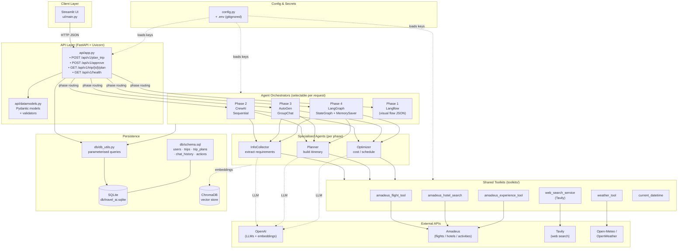

# TravelMate AI

A learning project that explores **four AI agent frameworks** end-to-end through a single use case: planning a multi-traveler trip with flights, hotels, experiences, weather, and cost optimization. Each "phase" implements the same workflow on a different orchestration framework so the patterns can be compared side by side.

---

## Phases

| Phase | Framework | Style | Folder |
|---|---|---|---|
| 1 | **Langflow** | Visual flow (exported JSON) | [phases/phase1_langflow](phases/phase1_langflow/) |
| 2 | **CrewAI** | Sequential agents (InfoCollector → Planner → Optimizer) | [phases/phase2_crewai](phases/phase2_crewai/) |
| 3 | **AutoGen** | Group-chat / conversational debate | [phases/phase3_autogen](phases/phase3_autogen/) |
| 4 | **LangGraph** | Stateful graph + checkpoints + human approval | [phases/phase4_langgraph](phases/phase4_langgraph/) |

---

## Architecture



**Request flow (happy path):**
1. User picks a phase + enters a trip request in the Streamlit UI.
2. UI calls `POST /api/v1/plan_trip` with `user_input`, `user_id`, `phase`.
3. FastAPI routes to the matching orchestrator (Phase 2/3/4).
4. Orchestrator runs its agents; agents call shared toolkits (Amadeus, weather, web search) and the OpenAI LLM.
5. Trip, plan, and chat history are persisted to SQLite via [db/db_utils.py](db/db_utils.py).
6. Response returned to UI, where the user can approve/reject via `POST /api/v1/approve`.

---

## Tech Stack

- **Language:** Python
- **Agent frameworks:** CrewAI, AutoGen / pyautogen, LangGraph (+ LangChain, langchain-openai, LangSmith), Langflow
- **LLM:** OpenAI (`gpt-4o-mini`, `gpt-5-mini`, `gpt-5-nano`, `gpt-4.1-mini`, `text-embedding-3-small`) — see [config.py](config.py)
- **Backend:** FastAPI + Uvicorn
- **Frontend:** Streamlit
- **Data models:** Pydantic
- **Storage:** SQLite (`db/travel_ai.sqlite`), ChromaDB (vector store)
- **External APIs:** Amadeus (flights/hotels/experiences), Tavily (web search), Open-Meteo / OpenWeather
- **Evaluation:** DeepEval
- **Testing:** pytest
- **Cloud SDK:** boto3 / botocore

---

## Project Structure

```
travel_agent/
├── api/                       FastAPI app, Pydantic models, tool wrappers
│   ├── app.py
│   ├── datamodels.py
│   └── tools.py
├── db/                        SQLite schema, seed data, DB helpers
│   ├── schema.sql
│   ├── seed_data.sql
│   ├── db_utils.py
│   └── setup_db.py
├── phases/
│   ├── phase1_langflow/       Visual flow export
│   ├── phase2_crewai/         Sequential agent orchestration
│   ├── phase3_autogen/        Group-chat orchestration
│   └── phase4_langgraph/      Stateful graph + checkpoints
├── toolkits/                  Shared tools used by agents
│   ├── amadeus_flight_tool.py
│   ├── amadeus_hotel_search.py
│   ├── amadeus_experience_tool.py
│   ├── weather_tool.py
│   ├── web_search_service.py
│   └── current_datetime.py
├── ui/main.py                 Streamlit UI
├── config.py                  Env / API-key / model config
└── requirements.txt
```

---

## Setup

### 1. Prerequisites
- Python 3.10+
- An OpenAI API key (required); Amadeus, Tavily, OpenWeather keys optional but recommended for full functionality.

### 2. Install
```bash
python -m venv .venv
source .venv/bin/activate     # Windows: .venv\Scripts\activate
pip install -r requirements.txt
```

### 3. Configure secrets
Create a `.env` file in the project root (it is gitignored):
```env
OPENAI_API_KEY=sk-...
OPENAI_BASE_URL=https://api.openai.com/v1
AMADEUS_CLIENT_ID=...
AMADEUS_CLIENT_SECRET=...
TAVILY_API_KEY=...
OPEN_WEATHER_API_KEY=...
LANGSMITH_API_KEY=...
```

### 4. Initialise the database
```bash
python db/setup_db.py
```

### 5. Run the API
```bash
uvicorn api.app:app --reload
# http://localhost:8000  ·  docs at /docs
```

### 6. Run the UI (separate terminal)
```bash
streamlit run ui/main.py
```

---

## API Reference

| Method | Path | Purpose |
|---|---|---|
| `POST` | `/api/v1/plan_trip` | Plan a trip with a chosen phase (`phase2_crewai` / `phase3_autogen` / `phase4_langgraph`). Supports multi-turn via `existing_trip_id` and `previous_requirements`. |
| `POST` | `/api/v1/approve` | Approve / reject a generated plan with optional feedback. |
| `GET`  | `/api/v1/trip/{trip_id}/plan` | Fetch a stored plan (optional `version`). |
| `POST` | `/api/v1/trip/{trip_id}/plan` | Save / overwrite a plan. |
| `PUT`  | `/api/v1/trip-plan/{plan_id}/status` | Update plan status. |
| `GET`  | `/api/v1/health` | Health check. |

### Example
```bash
curl -X POST "http://localhost:8000/api/v1/plan_trip" \
  --data-urlencode "user_input=Plan a trip from Bangalore to Goa, Dec 15-18 2026, 2 adults 2 kids, budget 2000 INR" \
  --data-urlencode "user_id=1" \
  --data-urlencode "phase=phase2_crewai"
```

---

## Security Notes

This is a **learning project** — the API has no authentication, authorization, CORS, or rate limiting wired up. Don't expose it on a public network as-is. Secrets are loaded from `.env` (gitignored) via [config.py](config.py); DB access uses parameterised SQL throughout [db/db_utils.py](db/db_utils.py).

---

## Status

The four phases were implemented incrementally as a comparative study of agent frameworks; per-phase progress and test notes are in the individual phase READMEs ([Phase 2](phases/phase2_crewai/README.md), [Phase 3](phases/phase3_autogen/README.md), [Phase 4](phases/phase4_langgraph/README.md)).
